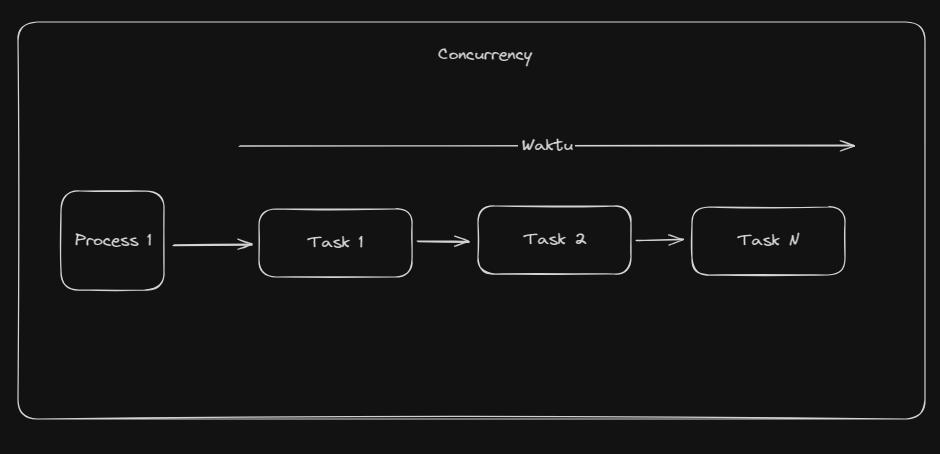
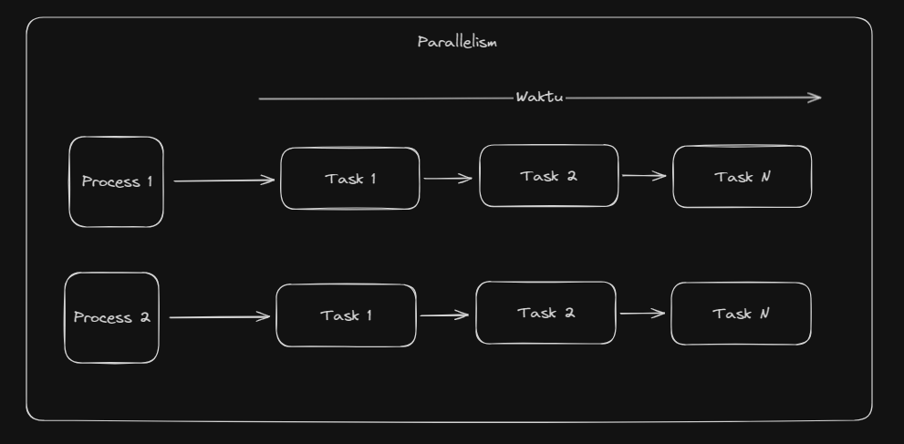
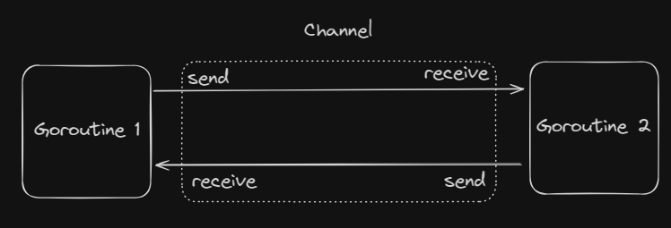

# Goroutines - Concurrency Di Golang

Go menyediakan fitur khusus yang biasa dikenal dengan **Goroutine**.
Goroutine adalah sebuah fungsi atau metode yang berjalan secara independen dan bersamaan dengan fungsi atau metode lainnya. Goroutine sangat ringan, hanya membutuhkan 2KB memory.

# Perbedaan Concurrency dan Parallelism

1. **Concurrency** adalah sebuah kemampuan untuk menjalankan lebih dari 1 task secara bersamaan. _contoh_: Ketika kamu lagi memasak nasi goreng, lalu kamu juga sedang memasak telur dadar, itu adalah contoh dari concurrency. Pada contoh ini, terdapat 2 task yang berjalan yaitu memasak nasi goreng dan memasak telur dadar, yang dimana pengerjaaan kedua task tersebut dilakukan secara sekaligus tetapi tidak secara paralel.
   

2. **Parallelism** adalah sebuah kemampuan untuk menjalankan lebih dari 1 task secara bersamaan pada waktu yang sama. _contoh_: Ketika kamu lagi belajar, tetapi kamu juga sedang mendengarkan musik, itu adalah contoh dari parallelism. Pada contoh ini, terdapat 2 task yang berjalan yaitu belajar dan mendengarkan musik, yang dimana pengerjaaan kedua task tersebut dilakukan secara sekaligus dan secara paralel.
   

# Cara Membuat Goroutine

```go
func main() {
	// call display function with go routine
	go display(1)

	// call display function without go routine
	display(2)
}

func display(number int) {
	// Display the number
	fmt.Println(number)
}

//output
2
```

Pada contoh diatas, kita membuat sebuah function `display()` dan memanggilnya dengan 2 cara yaitu dengan menggunakan goroutine dan tanpa goroutine. Namun ada masalah, ketika kita menjalankan program diatas, outputnya tidak sesuai dengan yang diharapkan. Hal ini terjadi karena goroutine berjalan secara asinkron, sehingga program utama tidak menunggu goroutine selesai. Untuk menunggu goroutine selesai, kita bisa menggunakan `time.Sleep()` atau `sync.WaitGroup`.

```go
func main() {
	// call display function with go routine
	go display(1)
	time.Sleep(1 * time.Second)

	// call display function without go routine
	display(2)
}

func display(number int) {
	// Display the number
	fmt.Println(number)
}

//output
1
2
```

kita bisa menggunakan `time.Sleep()` untuk menunggu goroutine selesai. Program ini membuat Goroutine utama menunggu selama 1 detik sebelum menampilkan output.

# Keuntungan Goroutine

- Goroutine sangat murah daripada thread biasa.
- Goroutine disimpan di dalam stack dan ukuran stack dapat membesar dan mengecil sesuai kebutuhan program.
- Gorutine dapat berkomunikasi menggunakan channel dan channel ini dirancang untuk mencegah race condition ketika mengakses memory secara bersamaan melalui goroutine.

# Anonymous Goroutine

```go
func main() {
	fmt.Println("Start")

	go func() {
		fmt.Println("Middle")
	}()

	time.Sleep(1 * time.Second)
	fmt.Println("End")
}

//output
Start
Middle
End
```

# Channel di Golang

Dalam Go, channel adalah sebuah tipe data yang memungkinkan **Goroutine** berkomunikasi satu sama lain tanpa menggunakan lock. Atau bisa dikatakan channel adalah sebuah teknik yang memungkinkan kita untuk mengirim data dari satu goroutine ke goroutine lainnya. Secara default channel bersifat 2 arah, artinya goroutine dapat mengirim atau menerima data melalui channel yang sama.



# Cara Membuat Channel

```go
func main() {
	// Create a channel
	ch := make(chan int)

	fmt.Println("Value of channel: ", ch)
}

//output
Value of channel: 0xc00001c0c0
```

# Mengirim dan Menerima Data Melalui Channel

Dalam Go, Channel bekerja dengan 2 fungsi utama, yaitu mengirim dan menerima data, kedua fungsi ini secara kolektif dikenal sebagai komunikasi. Dan operasi ini dilakukan dengan menggunakan operator `<-`. Dalam channel,

1. Operasi Send
   Operasi ini digunakan untuk mengirim data dari satu goroutine ke goroutine lainnya melalui channel. Value seperti string, integer, atau tipe data lainnya dapat dengan aman dikirim melalui channel karena value tersebut dicopy sehingga tidak ada resiko akses bersamaan. Tetapi untuk mengirim pointer atau reference melalui channel tidak aman karena value dari pointer atau reference tersebut bisa berubah oleh goroutine pengirim atau penerima pada saat yang sama. Di bawah ini adalah contoh operasi send.
   ```go
   ch <- 10
   ```
2. Operasi Menerima
   ```go
   value := <- ch
   ```
   Dalam contoh diatas menunjukkan bahwa kita menerima data dari channel `ch` dan menyimpannya dalam variabel `value`.

## Example

```go
func main() {
	fmt.Println("Start")
	// Create a channel
	ch := make(chan int)

	// Send data to channel
	go func() {
		ch <- 10
	}()

	// Receive data from channel
	value := <-ch
	fmt.Println("Value: ", value)

	fmt.Println("End")
}

//output
Start
Value:  10
End
```

# Close Channel

Kamu juga bisa close channel dengan menggunakan fungsi `close()`. Ini adalah function bawaan dan digunakan untuk set flag bahwa tidak ada data lagi yang akan dikirim melalui channel.

```go
close(ch)
```

## Example _close channel_

```go
func main() {
	fmt.Println("Start")
	// Create a channel
	ch := make(chan int)

	// Send data to channel
	go func() {
		ch <- 10
		close(ch)
	}()

	// Receive data from channel
	for {
		value, ok := <-ch
		if !ok {
			fmt.Println("Channel closed")
			break
		}

		fmt.Println("Value: ", value)
	}

	fmt.Println("End")
}

//output
Start
Value:  10
Channel closed
End
```

## Blocking Send and Receive

Dalam channel, ketika data dikirim ke channel, maka goroutine akan terblokir sampai ada goroutine lain yang menerima data dari channel tersebut. Begitu juga sebaliknya, ketika goroutine menerima data dari channel, maka goroutine akan terblokir sampai ada goroutine lain yang mengirim data ke channel tersebut.

## Zero Value of Channel

Zero value dari channel adalah `nil`.

## For Range Loop in Channel

```go
func main() {
	fmt.Println("Start")
	// Create a channel
	ch := make(chan int)

	// Send data to channel
	go func() {
		for i := 0; i < 5; i++ {
			ch <- i
		}
		close(ch)
	}()

	// Receive data from channel
	for value := range ch {
		fmt.Println("Value: ", value)
	}

	fmt.Println("End")
}

//output
Start
Value:  0
Value:  1
Value:  2
Value:  3
Value:  4
End
```

## Length and Capacity of Channel

```go
func main() {
	fmt.Println("Start")
	// Create a channel
	ch := make(chan int, 3)

	// Send data to channel
	ch <- 10
	ch <- 20
	ch <- 30

	// length of channel and capacity of channel
	fmt.Println("Length of channel: ", len(ch))
	fmt.Println("Capacity of channel: ", cap(ch))

	fmt.Println("End")
}

//output
Start
Value:  10
Value:  20
Value:  30
End
```

## Select Statement in Channel

Dalam Go, `select` statement sama seperti `switch` statement, tetapi digunakan untuk komunikasi antara goroutine. pernyataan `case` dalam `select` mengacu pada komunikasi, yaitu mengirim atau menerima data dari channel.

### Point Penting

1. `select` statement menunggu sampai komunikasi (send atau receive) siap untuk dijalankan.

```go
func main() {
	fmt.Println("Start")
	// Create a channel
	ch1 := make(chan string)
	ch2 := make(chan string)

	// Send data to channel
	go func() {
		time.Sleep(1 * time.Second)
		ch1 <- "From channel 1"
	}()

	go func() {
		time.Sleep(2 * time.Second)
		ch2 <- "From channel 2"
	}()

	// Receive data from channel
	select {
	case value := <-ch1:
		fmt.Println("Value from channel 1: ", value)
	case value := <-ch2:
		fmt.Println("Value from channel 2: ", value)
	}

	fmt.Println("End")
}

//output
Start
Value from channel 1:  From channel 1
End
```

Penjelasan: Program diatas membuat 2 goroutine yang mengirim data ke channel `ch1` dan `ch2` dengan delay 1 detik dan 2 detik. Kemudian program utama menunggu data dari channel `ch1` dan `ch2` menggunakan `select` statement. Program utama akan menerima data dari channel yang pertama kali siap.

2. Pernyataan default dalam select statement digunakan untuk menghindari blocking. Jika tidak ada case yang siap untuk dijalankan, maka pernyataan default akan dijalankan.

```go
func main() {
	// creating channel
	ch := make(chan int)
	select {
	case <-ch:

	default:
		fmt.Println("Not found")
	}
}

//output
Not found
```

3. Blocking dari select statement maksudnya adalah ketika tidak ada case yang siap untuk dijalankan dan tidak ada default case, maka program akan blocking.

```go
func main() {
	// creating channel
	ch := make(chan int)
	select {
	case <-ch:
	}
}

//output
fatal error: all goroutines are asleep - deadlock!
```

4. Dalam select statement, jika ada lebih dari satu case yang siap untuk dijalankan, maka case akan dipilih secara acak.

```go
func main() {
	// creating channel
	ch1 := make(chan string)
	ch2 := make(chan string)

	// send data to channel
	go func() {
		for i := 0; i < 3; i++ {
			ch1 <- "From channel 1"
		}
	}()

	go func() {
		ch2 <- "From channel 2"
	}()

	select {
	case value := <-ch1:
		fmt.Println("Value from channel 1: ", value)
	case value := <-ch2:
		fmt.Println("Value from channel 2: ", value)
	}
}

//output
Value from channel 2:  From channel 2
```
